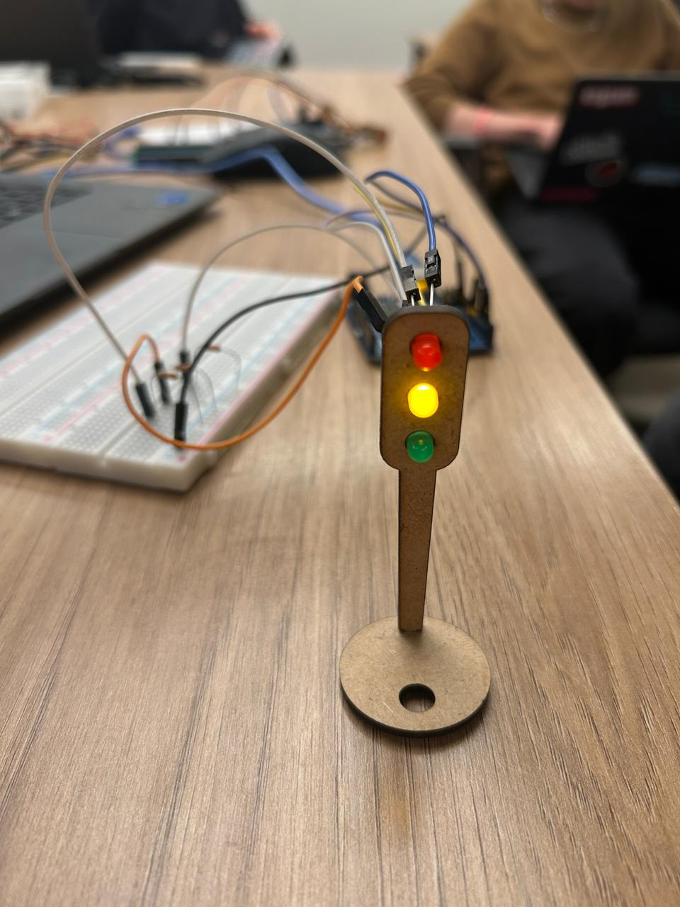
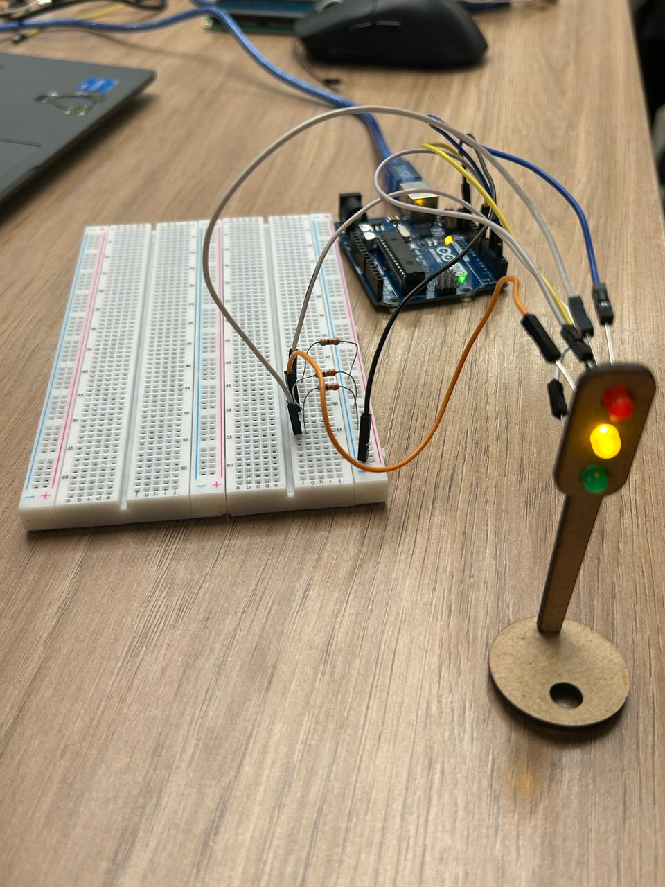

# Projeto: Semáforo com Ponteiros e Botão Liga/Desliga

## Autor
**Nome:** Tobias Viana Araújo

**Data:** 30/10/2025

## Parte 1: Montagem Física do Semáforo

A montagem foi feita utilizando três LEDs (vermelho, amarelo e verde) conectados em uma protoboard, representando as luzes de um semáforo convencional. Cada LED foi ligado a um resistor de 330 Ω para limitar a corrente e evitar danos aos componentes.

O semáforo foi conectado ao Arduino UNO, que controla a sequência de acendimento dos LEDs.
A montagem foi organizada de forma limpa para facilitar a visualização e identificação de cada fio.

### Componentes Utilizados
| Componente | Quantidade | Especificação / Observação |
|-------------|-------------|-----------------------------|
| LED Vermelho | 1 | Indica “Pare” |
| LED Amarelo | 1 | Indica “Atenção” |
| LED Verde | 1 | Indica “Siga” |
| Resistores | 3 | 330 Ω |
| Protoboard | 1 | Montagem física |
| Jumpers | Vários | Conexões entre pinos |
| Arduino UNO | 1 | Microcontrolador principal |

### 🔌 Esquema de Ligação
| LED | Pino Digital | Ligação |
|------|---------------|----------|
| Vermelho | 2 | 330 Ω → GND |
| Amarelo | 4 | 330 Ω → GND |
| Verde | 8 | 330 Ω → GND |

### Imagens da Montagem

Link do drive com video: https://drive.google.com/drive/folders/1onWjsSYbnZ_qoRmU0p2ZIyy0AzM7makj?usp=sharing





## Parte 2: Programação e Lógica do Semáforo

A lógica foi desenvolvida em C/C++ no Arduino IDE, utilizando ponteiros para controlar os LEDs e suas transições.
O código segue a seguinte temporização:

🔴 Vermelho: 6 segundos

🟢 Verde: 4 segundos

🟡 Amarelo: 2 segundos (com 3 piscadas antes de mudar)

Além disso, foi implementado um botão liga/desliga, que interrompe o funcionamento do semáforo enquanto estiver desligado.

**Lógica de Funcionamento**

Ao pressionar o botão, o semáforo é ativado.

O sistema entra em um loop que alterna entre as três cores com seus respectivos tempos.

O LED amarelo pisca três vezes (a cada 300 ms) antes de passar para o vermelho.

Se o botão for pressionado novamente, o sistema desliga e todos os LEDs são apagados.

**Código-fonte**

O código completo está disponível neste repositório no arquivo:
`arduino.ino`


**Avaliador:** Christian Vinícius  
**Data:** 30/10/2025

| Critério                         | Pontuação       | Observações                                               |
| -------------------------------- | --------------- | --------------------------------------------------------- |
| **Montagem Física** (0-4 pts)    | 4 / 4      | Cores corretas, disposição dos fios, resistores adequados |
| **Temporização** (0-3 pts)       | 3 / 3      | Tempos medidos com cronômetro                             |
| **Código e Estrutura** (0-3 pts) |  3 / 3      | Lógica correta, comentários, nomenclatura                 |
| **TOTAL**                        | **10 / 10** |                                                           |

**Comentários adicionais:**

```
O projeto foi executado com excelência, atendendo a todos os critérios estabelecidos, indo além ao utilizar ponteiros no código. A montagem física está adequada, com todos os componentes conectados corretamente, os leds funcionam corretamente (com o tempo aceso adequado à proposta e de forma precisa, além de conexão adequada com uso dos resistores). O código está bem estruturado, objetivo e com lógica clara e comentários que facilitam a compreensão do funcionamento do sistema. Parabéns pelo excelente trabalho, Tobias Viana, te amo!
```

**Avaliador:** Anny Jhulia Cerazi

| Critério                         | Pontuação       | Observações                                               |
| -------------------------------- | --------------- | --------------------------------------------------------- |
| **Montagem Física** (0-4 pts)    | 4 / 4      | Cores corretas, disposição dos fios, resistores adequados |
| **Temporização** (0-3 pts)       | 3 / 3      | Tempos medidos com cronômetro                             |
| **Código e Estrutura** (0-3 pts) |  3 / 3      | Lógica correta, comentários, nomenclatura                 |
| **TOTAL**                        | **10 / 10** |                                                           |

**Comentários adicionais:**

```
Tobias, ótimo trabalho!
A montagem física está correta. O código está bem organizado, e você foi além adicionando um botão para controle do semáforo, porém a lógica geral de apenas ligá-lo é confusa e, por isso, sugiro uma revisão. Solucionou o problema do botão retirando-o, mas mesmo assim foi além ao utilizar ponteiros em seu código. No geral, foi muito bem!
```

## Conclusão

O projeto demonstra o funcionamento prático de um semáforo eletrônico com controle de tempo e lógica sequencial, utilizando ponteiros para manipular os LEDs de forma mais flexível.
A adição do botão liga/desliga e do piscar no amarelo tornam o protótipo mais interativo e próximo do comportamento real de um semáforo urbano.